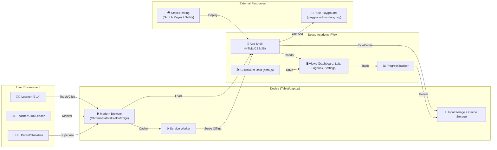

# Business Requirements Document (BRD)
## Space Academy — Rust for Kids

---

## 1. Executive Summary

**Space Academy** is a free, open-source Progressive Web App (PWA) that teaches computational thinking and the Rust programming language to children aged 9–14 through a 12-week, story-driven curriculum. The app runs entirely in the browser, works offline, and requires no installation, backend, or account creation — making it ideal for classrooms, coding clubs, and home learning on tablets or laptops.

---

## 2. Business Background

### 2.1 Problem Context
- **Gap in CS education**: Most introductory coding tools use block-based languages (Scratch) or dynamic languages (Python, JavaScript). Few introduce systems programming concepts (ownership, borrowing, memory safety) early.
- **Rust's learning curve**: Rust is perceived as "hard" for beginners due to its strict compiler and novel ownership model. Existing resources target adults.
- **Access barriers**: Many coding platforms require accounts, internet connectivity, or specific hardware — excluding schools with limited IT infrastructure.

### 2.2 Solution Positioning
Space Academy bridges this gap by:
- Framing Rust concepts through a **space exploration narrative** (missions, pilots, badges)
- Using **visual metaphors** (fuel tanks for variables, cargo bays for vectors, mission control for functions)
- Delivering as a **zero-install PWA** that works on any device with a browser
- Providing **offline-first** operation for unreliable connectivity environments

---

## 3. Problem Statement

> **Children aged 9–14 lack an accessible, engaging entry point to systems programming concepts (memory safety, ownership, concurrency) that builds computational thinking skills transferable to any language.**

Current alternatives either:
- Teach only high-level scripting (missing systems concepts)
- Require complex toolchain setup (rustup, IDE, terminal)
- Assume adult-level reading comprehension and abstract reasoning

---

## 4. Business Objectives (SMART)

| # | Objective | Metric | Target | Timeline |
|---|-----------|--------|--------|----------|
| OBJ-1 | **Reach** | Unique pilots (localStorage profiles created) | 1,000+ | 6 months post-launch |
| OBJ-2 | **Engagement** | % of pilots completing ≥8 weeks | ≥40% | 12 months |
| OBJ-3 | **Retention** | Return visits within 7 days | ≥50% | Ongoing |
| OBJ-4 | **Completion** | Pilots earning "Mission Commander" badge (Week 12) | ≥15% of starters | 12 months |
| OBJ-5 | **Adoption** | Classrooms/clubs using as curriculum | 25+ | 12 months |
| OBJ-6 | **Accessibility** | WCAG 2.1 AA compliance score | ≥95% | Launch + 3 months |
| OBJ-7 | **Offline reliability** | App loads & functions without network | 100% | Launch |

---

## 5. Stakeholders & Roles

| Stakeholder | Role | Interest |
|-------------|------|----------|
| **Learners (Kids 9–14)** | Primary users | Fun, progress, badges, story |
| **Parents/Guardians** | Decision makers | Safety, educational value, no ads/data collection |
| **Teachers/Club Leaders** | Facilitators | Curriculum alignment, progress tracking, offline use |
| **Open Source Contributors** | Developers | Code quality, extensibility, documentation |
| **Rust Foundation / Edu WG** | Ecosystem partners | Language adoption, feedback loop |
| **School IT Admins** | Gatekeepers | No install, no accounts, privacy compliant |

---

## 6. Business Requirements (Capabilities)

| ID | Capability | Description | Priority |
|----|------------|-------------|----------|
| BR-01 | **Curriculum Delivery** | Present 12-week structured curriculum across 3 arcs (Foundations, Systems, Capstone) | Must |
| BR-02 | **Progress Persistence** | Track per-pilot progress (completed weeks, checklist items, badges) locally | Must |
| BR-03 | **Offline Operation** | Full app functionality without internet after first load | Must |
| BR-04 | **Multi-Pilot Support** | Switch between up to 8 pilot profiles with avatars/names | Must |
| BR-05 | **Badge & Achievement System** | Award badges for week completion, streak, mastery | Must |
| BR-06 | **Code Lab / Playground** | Interactive Rust code editor with syntax highlighting & run simulation | Must |
| BR-07 | **Data Portability** | Export/import progress as JSON for backup/transfer | Should |
| BR-08 | **Teacher Dashboard (View-Only)** | Read-only view of all pilots' progress (local only) | Could |
| BR-09 | **Curriculum Extensibility** | Add/edit weeks, challenges, badges via data file (no code change) | Should |
| BR-10 | **Accessibility** | Keyboard navigation, screen reader support, high contrast | Must |
| BR-11 | **Privacy by Design** | No personal data collection, no accounts, no telemetry | Must |
| BR-12 | **Installability** | "Add to Home Screen" on iOS/Android/Chrome OS | Must |

---

## 7. Scope

### In Scope
- 12-week curriculum (3 arcs × 4 weeks)
- PWA with Service Worker offline caching
- Local progress tracking (localStorage)
- Code Lab with simulated Rust execution
- Badge system + pilot profiles
- Static hosting (GitHub Pages, Netlify, etc.)

### Out of Scope
- **Backend / cloud sync** — no server, no database, no accounts
- **Real Rust compilation** — playground simulates output; no WASM rustc
- **Multiplayer / social features** — no leaderboards, sharing, chat
- **Teacher assignment/grading tools** — view-only progress
- **Native mobile apps** — PWA only
- **Localization (i18n)** — English only for v1

---

## 8. Success Metrics / KPIs

| KPI | Definition | Measurement |
|-----|------------|-------------|
| **Weekly Active Pilots** | Unique localStorage profiles with activity in 7 days | `localStorage` key count + timestamp |
| **Curriculum Completion Rate** | % pilots reaching Week 12 / total pilots started | Badge "Mission Commander" / total pilots |
| **Offline Session Rate** | % sessions with `navigator.onLine === false` | Service Worker fetch event logs |
| **Average Weeks Completed** | Mean weeks completed per pilot | ProgressTracker data |
| **Return Rate (D7)** | % pilots active on day 7 after first session | Timestamp comparison |
| **Error Rate** | Uncaught JS errors per 1k sessions | `window.onerror` + Sentry (opt-in only) |

---

## 9. Assumptions, Constraints, Risks

### Assumptions
- Target devices have modern browsers (Chrome 80+, Firefox 75+, Safari 14+, Edge 80+)
- Users have ~100 MB storage for SW cache + localStorage
- Curriculum content fits in ~50 KB JSON
- No server-side infrastructure available

### Constraints
- **No build step** — vanilla ES modules only (GitHub Pages constraint)
- **No backend** — all state client-side
- **Tablet-first** — touch targets ≥48px, viewport meta, no hover-only UX
- **Content size** — keep total < 5 MB for fast offline caching

### Risks

| Risk | Likelihood | Impact | Mitigation |
|------|------------|--------|------------|
| Browser storage cleared (private mode, cleanup) | Medium | High (progress loss) | Export/import JSON; educate users |
| Service Worker cache corruption | Low | High (app broken) | Versioned cache names; "Clear Cache" button in Settings |
| Curriculum errors (wrong Rust concepts) | Medium | Medium | Peer review by Rust educators; issue tracker |
| Accessibility gaps exclude users | Medium | High | Automated axe-core tests + manual testing |
| Syntax highlighter misleading beginners | Medium | Low | Clear "simulated" labels; link to playground.rust-lang.org |

---

## 10. Milestones

| Milestone | Target Date | Deliverables |
|-----------|-------------|--------------|
| **M1: Alpha** | Week 4 | Core router, progress tracker, 4 weeks content, SW |
| **M2: Beta** | Week 8 | All 12 weeks, Code Lab, badges, pilot profiles, manifest |
| **M3: Launch v1.0** | Week 12 | Accessibility audit, offline test, export/import, docs |
| **M4: Classroom Pilot** | Week 16 | Teacher guide, 3+ classroom deployments, feedback loop |
| **M5: v1.1** | Week 24 | i18n framework, Week 7 content review, TypeScript migration plan |

---

## 11. System Context (Mermaid)

---

*Document Version: 1.0*  
*Last Updated: Based on codebase analysis (commit 83c1c27)*  
*Classification: Public*