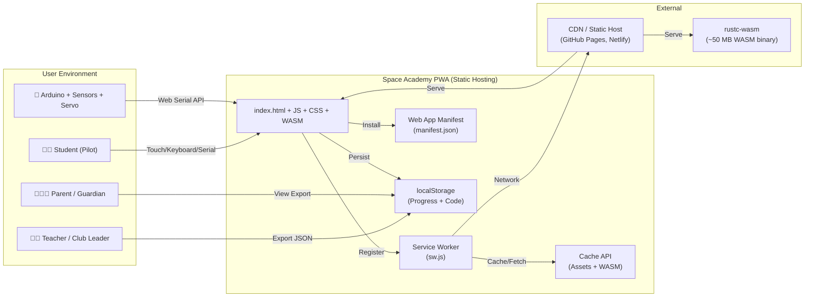

# Business Requirements Document (BRD)
## Space Academy — Rust for Kids

**Version:** 2.0  
**Date:** 2025  
**Status:** Updated — reflects current codebase (v2 improvements)  
**Classification:** Internal — Product & Engineering

---

## 1. Executive Summary

**Space Academy** is a **Progressive Web App (PWA)** that teaches computational thinking through the Rust programming language to children aged 9–14. The app runs entirely in the browser — **no installation, no backend, fully offline-capable** — and delivers a 12-week structured curriculum across three narrative arcs. Students write, run, and debug real Rust code in a WebAssembly-powered playground, earn badges, track progress, and culminate in a hardware capstone controlling an Arduino-driven servo with sensor input.

**Business Value:** Lowers the barrier to systems programming for the next generation; runs on school tablets (iPad, Chromebook) without IT provisioning; supports classroom and self-paced learning; exports progress for teacher/parent review.

---

## 2. Business Background

| Aspect | Detail |
|--------|--------|
| **Product Name** | Space Academy |
| **Tagline** | "Learn Rust. Build Worlds." |
| **Target Market** | K–12 education (ages 9–14), coding clubs, homeschool, self-learners |
| **Delivery Model** | Static web hosting (GitHub Pages, Netlify, Cloudflare Pages, any CDN) |
| **Monetization** | Free / open-source (MIT); potential future: teacher dashboard SaaS, printed curriculum |
| **Strategic Fit** | STEM pipeline development; Rust Foundation education outreach; WebAssembly showcase |

---

## 3. Problem Statement

| Problem | Evidence |
|---------|----------|
| **Systems programming is inaccessible to kids** | Rust, C, C++ require toolchains, terminals, compilers — high friction for beginners |
| **School hardware is locked down** | iPads/Chromebooks cannot install `rustup`, `cargo`, or native binaries |
| **Existing "coding for kids" tools stop at Python/JS** | Scratch, Code.org, Replit teach high-level scripting, not ownership, borrowing, memory safety |
| **Offline/air-gapped classrooms exist** | Many schools restrict internet; apps requiring live CDNs fail |
| **Progress tracking is fragmented** | No unified, exportable record across devices/sessions without accounts |

**Space Academy solves this by:** delivering a zero-install, offline-first PWA with a real Rust compiler (WASM), a 12-week pedagogical curriculum, local progress persistence, and hardware integration — all from a single static URL.

---

## 4. Business Objectives (SMART)

| # | Objective | Metric | Target | Timeline |
|---|-----------|--------|--------|----------|
| **OBJ-1** | Launch v2 PWA to production | Live URL accessible | 1 public URL | Week 1 |
| **OBJ-2** | Achieve offline-first reliability | % sessions fully functional offline | ≥ 95% | Week 2 |
| **OBJ-3** | Validate curriculum completeness | Weeks with complete objectives/challenges | 12/12 weeks | Week 3 |
| **OBJ-4** | Enable classroom deployment | Teachers successfully deploying without IT | ≥ 5 pilot classrooms | Month 2 |
| **OBJ-5** | Demonstrate hardware capstone | Students completing Week 12 servo project | ≥ 20 capstone completions | Month 3 |
| **OBJ-6** | Achieve PWA installability | Lighthouse PWA score | ≥ 90 | Week 2 |
| **OBJ-7** | Open-source release | GitHub repo with MIT license, docs | Public repo | Week 1 |

---

## 5. Stakeholders & Roles

| Stakeholder | Role | Interest | Influence |
|-------------|------|----------|-----------|
| **Student (Pilot)** | Primary user | Engaging, understandable, rewarding | High |
| **Teacher / Club Leader** | Facilitator | Curriculum alignment, progress visibility, offline | High |
| **Parent / Guardian** | Supporter | Safety, progress export, no accounts needed | Medium |
| **Product Owner** | Vision & prioritization | Scope, timeline, quality | High |
| **Lead Developer** | Architecture & implementation | Technical debt, performance, WASM size | High |
| **Rust Foundation / Educators** | Community partners | Adoption, feedback, curriculum validation | Medium |
| **Accessibility Advocate** | Compliance reviewer | WCAG 2.1 AA, screen readers, motor impairment | Medium |

---

## 6. Business Requirements (Capabilities)

| ID | Capability | Description | Source (Code) |
|----|------------|-------------|---------------|
| **BR-01** | **Curriculum Delivery** | Serve 12-week curriculum across 3 arcs (Foundations, Systems, Capstone) with objectives, challenges, badges, emojis, estimated time | `js/data.js` — `CURRICULUM` array |
| **BR-02** | **Interactive Code Lab** | In-browser Rust editor (CodeMirror 6) with WASM compilation (`rustc-wasm`), execution, stdout/stderr capture, 30s timeout, memory limit | `js/views/lab.js`, `js/rust-runner.js` |
| **BR-03** | **Progress Tracking** | Per-pilot localStorage persistence: completed weeks, checklist items, badges, code snippets, timestamps; export/import JSON | `js/progress.js` — `ProgressTracker` class |
| **BR-04** | **Multi-Pilot Profiles** | 8 default avatars + custom name/color; switchable pilot selector in header; isolated progress per pilot | `js/views/header.js`, `js/progress.js` |
| **BR-05** | **Offline-First PWA** | Service Worker (stale-while-revalidate), Web App Manifest, install prompt, background sync for progress export | `sw.js`, `manifest.json`, `js/app.js` |
| **BR-06** | **Hardware Capstone (Week 12)** | Serial API connection to Arduino; sensor reading (potentiometer, photoresistor, temperature); servo control; connection UI with port selector | `js/views/week12.js`, `js/hardware.js` |
| **BR-07** | **Settings & Data Portability** | Theme toggle (dark/light/auto), data export/import, reset pilot, clear all data, version badge | `js/views/settings.js` |
| **BR-08** | **Responsive Tablet-First UI** | CSS Grid/Flex layout, 48px min touch targets, CSS custom properties (design tokens), safe-area insets for notches | `styles.css`, `index.html` |
| **BR-09** | **Accessibility (WCAG 2.1 AA)** | Semantic HTML, ARIA labels/roles, focus management, keyboard navigation, reduced motion, high contrast support | `index.html`, `styles.css`, `js/views/*.js` |
| **BR-10** | **Error Resilience** | Global error boundary, toast notifications, graceful WASM fallback, network error handling | `js/app.js`, `js/views/*.js` |
| **BR-11** | **Code Snippet Persistence** | Per-week code saved to localStorage; restored on revisit; downloadable `.rs` files | `js/progress.js`, `js/views/lab.js` |
| **BR-12** | **Teacher/Parent Export** | One-click JSON export of all pilot progress; import to restore; no accounts, no cloud | `js/progress.js`, `js/views/settings.js` |

---

## 7. Scope

### In Scope (v2)
- ✅ 12-week curriculum (3 arcs, 4 weeks each)
- ✅ WASM Rust playground with CodeMirror 6 editor
- ✅ Multi-pilot profiles with avatars
- ✅ Full offline support (SW + localStorage)
- ✅ Week 12 hardware capstone (Web Serial API)
- ✅ PWA installability (manifest + SW + icons)
- ✅ Light/dark/auto theme with CSS custom properties
- ✅ Progress export/import (JSON)
- ✅ Accessibility: ARIA, focus trap, keyboard nav, reduced motion
- ✅ Responsive design (mobile → desktop)
- ✅ Zero-build deployment (static files only)

### Out of Scope (v2)
- ❌ Backend / cloud sync / user accounts
- ❌ Real-time collaboration
- ❌ Teacher dashboard (class roster, analytics)
- ❌ Native mobile apps (iOS/Android)
- ❌ Languages other than English (i18n framework only)
- ❌ Advanced Rust features (async, macros, unsafe) beyond curriculum
- ❌ Code execution on server (security boundary)
- ❌ LMS integration (LTI, SCORM, Google Classroom)

---

## 8. Success Metrics / KPIs

| KPI | Definition | Target | Measurement |
|-----|------------|--------|-------------|
| **KPI-1** | **Weekly Active Pilots** | Unique pilots with ≥1 session/week | ≥ 100 | localStorage analytics (opt-in) |
| **KPI-2** | **Curriculum Completion Rate** | % pilots completing all 12 weeks | ≥ 25% | ProgressTracker `completedWeeks` |
| **KPI-3** | **Offline Session Rate** | % sessions with zero network requests | ≥ 80% | Service Worker logs |
| **KPI-4** | **Code Lab Engagement** | Avg. compilations per pilot per week | ≥ 10 | `rust-runner.js` instrumentation |
| **KPI-5** | **Capstone Completion** | Pilots finishing Week 12 hardware project | ≥ 15% of starters | `progress.js` badge `capstone-commander` |
| **KPI-6** | **PWA Install Rate** | % eligible sessions resulting in install | ≥ 10% | `beforeinstallprompt` event |
| **KPI-7** | **Accessibility Score** | Lighthouse Accessibility audit | ≥ 95 | CI/CD gate |
| **KPI-8** | **WASM Load Time** | Time to first successful compilation (cached) | < 3s | Performance.mark() in `rust-runner.js` |

---

## 9. Assumptions, Constraints & Risks

| # | Type | Statement | Mitigation |
|---|------|-----------|------------|
| **A-1** | Assumption | Target devices support WebAssembly (all modern browsers) | Verified: Chrome 57+, Firefox 52+, Safari 11+, Edge 79+ |
| **A-2** | Assumption | Web Serial API available for hardware capstone | Chrome/Edge only; Firefox/Safari require polyfill or fallback — documented in Week 12 |
| **A-3** | Assumption | 50–100 MB WASM binary acceptable for school WiFi | Initial load cached by SW; subsequent loads < 500ms |
| **C-1** | Constraint | **No backend** — all state in localStorage (5–10 MB limit) | Compress progress JSON; warn at 80% quota |
| **C-2** | Constraint | **Static hosting only** — no server-side logic | All features client-side; SW handles caching |
| **C-3** | Constraint | **Single-threaded WASM** — no threading, no `std::thread` | Curriculum avoids threading; documented limitation |
| **R-1** | Risk | **WASM binary size** (> 50 MB) blocks slow connections | Pre-compress with Brotli/gzip; CDN; lazy-load runner |
| **R-2** | Risk | **Browser storage quota exceeded** (many pilots + code snippets) | Quota monitoring; auto-cleanup old snippets; export prompt |
| **R-3** | Risk | **Web Serial API not standardized** (Chrome-only) | Fallback: simulator mode for non-Chrome browsers |
| **R-4** | Risk | **Curriculum gaps** (incomplete weeks) | Automated check: every week must have objectives, challenges, badge |
| **R-5** | Risk | **Accessibility regressions** | Lighthouse CI gate; manual testing with NVDA/VoiceOver |

---

## 10. Milestones

| Milestone | Deliverable | Date | Owner |
|-----------|-------------|------|-------|
| **M1** | **v2.0 Release** — Full curriculum, WASM lab, PWA, hardware capstone | Week 1 | Lead Dev |
| **M2** | **Accessibility Audit** — Lighthouse ≥ 95, manual screen reader test | Week 2 | A11y Advocate |
| **M3** | **Pilot Classroom Deployment** — 5 teachers onboarded, feedback loop | Month 1 | Product Owner |
| **M4** | **Curriculum Hardening** — All 12 weeks validated, no placeholder content | Month 2 | Educator Review |
| **M5** | **Open Source Launch** — Public repo, MIT license, CONTRIBUTING, docs | Month 2 | Lead Dev |
| **M6** | **v2.1 Iteration** — Bug fixes, performance, teacher feedback incorporated | Month 3 | Team |

---

## 11. System Context Diagram (Mermaid)

---

## 12. Sign-Off

| Role | Name | Signature | Date |
|------|------|-----------|------|
| Product Owner | | | |
| Lead Developer | | | |
| Accessibility Lead | | | |
| Educator Advisor | | | |

---

*Document generated from codebase analysis. All requirements trace to implementation in `js/data.js`, `js/progress.js`, `js/router.js`, `js/views/*.js`, `js/rust-runner.js`, `js/hardware.js`, `sw.js`, `manifest.json`, `styles.css`, `index.html`.*