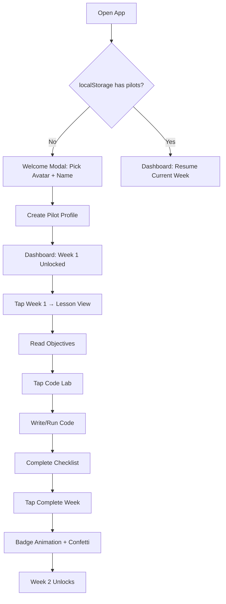
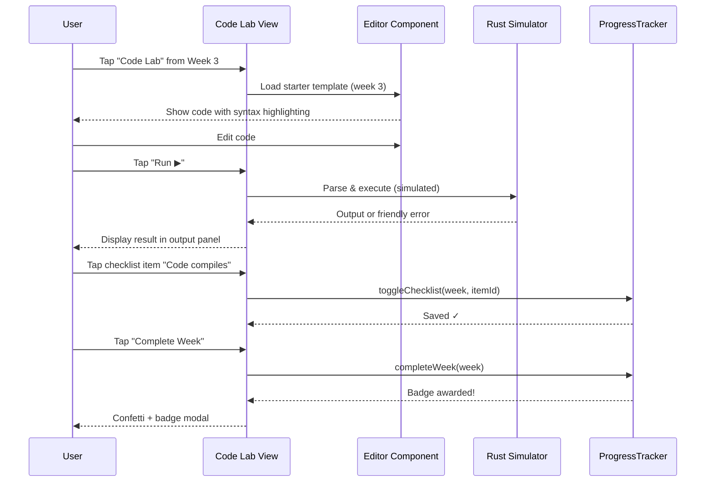
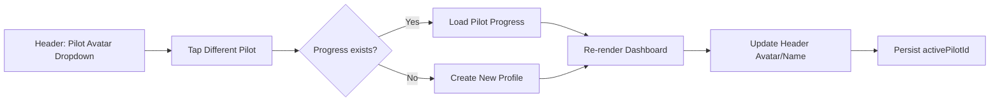

# Product Requirements Document (PRD)
## Space Academy — Rust for Kids

---

## 1. Vision

**Empower every child to think like a systems engineer** — by making Rust's core concepts (ownership, borrowing, memory safety) intuitive, visual, and fun through a space exploration adventure that runs anywhere a browser runs.

> *"Rust isn't hard — it's just honest about memory. Kids deserve that honesty."*

---

## 2. Target Users & Personas

### Primary: **Nova (Age 10, Curious Coder)**
- **Context**: Uses tablet at home, 30–45 min sessions, 3×/week
- **Experience**: Scratch/Code.org veteran; reads well; loves space/sci-fi
- **Goals**: "Make real code that controls things"; earn all badges; show parents
- **Pain points**: Typing on tablet; abstract concepts; losing progress

### Secondary: **Mr. Chen (Teacher, Coding Club)**
- **Context**: 15 students, 1-hour weekly sessions, mixed devices (iPads, Chromebooks)
- **Experience**: Comfortable with Scratch/Python; new to Rust
- **Goals**: Structured curriculum; see all students' progress; works offline
- **Pain points**: No IT support for installs; varying reading levels; limited prep time

### Tertiary: **Alex (Parent, Non-Technical)**
- **Context**: Wants safe, educational screen time; no ads/data harvesting
- **Goals**: Child learns "real programming"; progress visible; easy to start
- **Pain points**: Complex setup; privacy concerns; child frustration

---

## 3. Use Cases / User Stories

| ID | User Story | Acceptance Criteria |
|----|------------|---------------------|
| UC-01 | As **Nova**, I want to **pick a pilot avatar and name** so that **my progress feels personal** | 8 avatars available; name editable; persists across sessions |
| UC-02 | As **Nova**, I want to **see a mission map with 12 weeks** so that **I know my journey** | 3 arcs visible; locked/unlocked state; current week highlighted |
| UC-03 | As **Nova**, I want to **complete a week's lesson and challenges** so that **I earn a badge** | Checklist items tickable; "Complete Week" button awards badge; confetti animation |
| UC-04 | As **Nova**, I want to **write Rust code in the Code Lab** so that **I experiment safely** | Editor with syntax highlighting; "Run" shows simulated output; errors explained simply |
| UC-05 | As **Nova**, I want to **switch pilots** so that **my sibling can use the same tablet** | Pilot selector in header; each pilot has isolated progress |
| UC-06 | As **Mr. Chen**, I want to **view all pilots' progress at a glance** so that **I track the class** | Settings → "Class View" shows table: pilot, weeks done, badges, last active |
| UC-07 | As **Alex**, I want to **export Nova's progress** so that **I can back it up** | Settings → "Export" downloads JSON; import restores exactly |
| UC-08 | As **Nova**, I want the **app to work on the bus (offline)** so that **I never lose momentum** | Service Worker caches all assets; app loads fully offline; progress saves locally |
| UC-09 | As **Nova**, I want to **install the app on my home screen** so that **it feels like a real app** | PWA manifest + SW meet install criteria; "Add to Home Screen" prompt appears |
| UC-10 | As **Nova (low vision)**, I want **high contrast and large text** so that **I can read comfortably** | CSS respects `prefers-contrast` and `prefers-reduced-motion`; 48px touch targets |

---

## 4. Functional Requirements

### 4.1 Curriculum Engine (FR-CURR)

| ID | Requirement | Details |
|----|-------------|---------|
| FR-CURR-01 | **12-Week Structure** | 3 arcs × 4 weeks; each week: title, emoji, objectives (3–5), challenges (3–5), badge |
| FR-CURR-02 | **Arc Progression** | Arc 1: Foundations (variables, functions, loops, conditionals) Arc 2: Systems (structs, vectors, ownership, modules) Arc 3: Capstone (hardware: Arduino + sensors + servo) |
| FR-CURR-03 | **Week Unlock Logic** | Week N+1 unlocks only after Week N completed (badge earned) |
| FR-CURR-04 | **Content Data-Driven** | All curriculum in `js/data.js` — add/edit weeks without code changes |
| FR-CURR-05 | **Challenge Types** | `code` (write snippet), `quiz` (multiple choice), `explain` (text reflection), `build` (multi-file) |

### 4.2 Progress Tracking (FR-PROG)

| ID | Requirement | Details |
|----|-------------|---------|
| FR-PROG-01 | **Per-Pilot Isolation** | Each pilot: `completedWeeks[]`, `checklist{}`, `badges[]`, `streak`, `lastActive` |
| FR-PROG-02 | **Checklist Persistence** | Per-week checklist items (objectives + challenges) tickable; saved instantly |
| FR-PROG-03 | **Badge Awarding** | Auto-award on week completion; streak badges (3, 7, 14 days); mastery (all challenges) |
| FR-PROG-04 | **Streak Calculation** | Consecutive days with any activity; resets on gap |
| FR-PROG-05 | **Export/Import** | JSON with schema version; validates on import; merges or replaces |

### 4.3 Code Lab (FR-LAB)

| ID | Requirement | Details |
|----|-------------|---------|
| FR-LAB-01 | **Editor** | `<textarea>` + line numbers; tab = 2 spaces; auto-indent |
| FR-LAB-02 | **Syntax Highlighting** | Keywords, types, strings, comments, numbers, macros (`!`), lifetimes (`'`) |
| FR-LAB-03 | **Simulated Execution** | "Run" button → parses simple patterns (`println!`, `let`, `fn`, loops) → shows output |
| FR-LAB-04 | **Error Messages** | Kid-friendly: "Did you forget a semicolon?" not "expected `;` token" |
| FR-LAB-05 | **Starter Templates** | Per-week boilerplate (e.g., `fn main() { ... }` with TODO comments) |
| FR-LAB-06 | **Link to Real Playground** | "Open in Rust Playground" button → `playground.rust-lang.org` with code prefilled |

### 4.4 Pilot Management (FR-PILOT)

| ID | Requirement | Details |
|----|-------------|---------|
| FR-PILOT-01 | **8 Default Avatars** | Emoji: 🚀👨‍🚀👩‍🚀🛸🛰️🌙⭐🪐 |
| FR-PILOT-02 | **Custom Name** | Editable inline; max 20 chars; sanitized |
| FR-PILOT-03 | **Active Pilot Indicator** | Header shows avatar + name; dropdown to switch |
| FR-PILOT-04 | **Delete Pilot** | Confirmation modal; removes all progress |

### 4.5 PWA / Offline (FR-PWA)

| ID | Requirement | Details |
|----|-------------|---------|
| FR-PWA-01 | **Service Worker** | `sw.js` with `stale-while-revalidate`; cache name versioned (`space-academy-v1`) |
| FR-PWA-02 | **App Manifest** | `manifest.json`: name, icons (192/512), theme color, display: standalone |
| FR-PWA-03 | **Offline Indicator** | Toast "You're offline — progress saved locally" when `navigator.onLine === false` |
| FR-PWA-04 | **Update Prompt** | On SW update: "New version available — refresh to update" |

### 4.6 Settings & Data (FR-SET)

| ID | Requirement | Details |
|----|-------------|---------|
| FR-SET-01 | **Theme Toggle** | Dark (default) / Light / System; persists in localStorage |
| FR-SET-02 | **Reduced Motion** | Respects `prefers-reduced-motion`; disables starfield animation |
| FR-SET-03 | **Clear Cache Button** | Forces SW unregister + cache delete + reload |
| FR-SET-04 | **About/Version** | Shows app version, curriculum version, links to GitHub |

---

## 5. Non-Functional Requirements

| Category | Requirement | Target |
|----------|-------------|--------|
| **Performance** | First Contentful Paint (cached) | < 800 ms on 3G |
| **Performance** | Time to Interactive | < 1.5 s |
| **Performance** | Bundle size (JS + CSS) | < 100 KB gzipped |
| **Reliability** | Offline functionality | 100% features work offline |
| **Reliability** | Data loss probability | < 0.1% (localStorage + export) |
| **Usability** | Touch target size | ≥ 48 × 48 px |
| **Usability** | Readability (body text) | ≥ 16 px, 1.6 line-height |
| **Accessibility** | WCAG 2.1 AA | Pass automated + manual audit |
| **Accessibility** | Keyboard navigation | All interactive elements reachable |
| **Accessibility** | Screen reader | ARIA labels on modals, tabs, progress |
| **Security** | CSP | `default-src 'self'; script-src 'self'; style-src 'self' 'unsafe-inline'` |
| **Security** | No external requests | Except Rust Playground link (user-initiated) |
| **Privacy** | Zero data collection | No analytics, no tracking, no cookies |
| **Compatibility** | Browsers | Chrome 80+, Firefox 75+, Safari 14+, Edge 80+ |
| **Compatibility** | Devices | Tablet (iPad, Android, Fire), Chromebook, Desktop |
| **Maintainability** | Curriculum updates | Edit `data.js` only; no code deploy |
| **Maintainability** | Code modularity | ES modules; single responsibility per file |

---

## 6. UX Flows (Mermaid)

### 6.1 First-Time User Flow

### 6.2 Code Lab Interaction Flow

### 6.3 Pilot Switch Flow

---

## 7. Dependencies

| Dependency | Type | Version | Purpose |
|------------|------|---------|---------|
| **None (Runtime)** | — | — | Zero external JS deps |
| **Rust Playground** | External Link | — | "Try real Rust" button |
| **GitHub Pages / Netlify** | Hosting | — | Static hosting + HTTPS |
| **Service Worker API** | Browser API | — | Offline caching |
| **Cache Storage API** | Browser API | — | Asset caching |
| **localStorage** | Browser API | — | Progress persistence |
| **Web App Manifest** | Browser API | — | Installability |

---

## 8. Prioritization (MoSCoW)

### Must Have (Launch Blockers)
- [x] 12-week curriculum data structure
- [x] Hash-based router + view rendering
- [x] ProgressTracker with localStorage
- [x] Pilot profiles (8 avatars, names)
- [x] Week completion + badge awarding
- [x] Code Lab with syntax highlighting + simulation
- [x] Service Worker + Manifest (PWA)
- [x] Export/Import progress JSON
- [x] Responsive CSS (tablet-first)
- [ ] Accessibility audit (WCAG 2.1 AA)
- [ ] Offline testing on target devices

### Should Have (Post-Launch v1.1)
- [ ] Teacher "Class View" dashboard
- [ ] Week 7 content review/completion
- [ ] Improved syntax highlighter (highlight.js CDN)
- [ ] Reduced motion / high contrast modes
- [ ] Keyboard navigation for all modals/tabs

### Could Have (v1.2+)
- [ ] Curriculum versioning in export/import
- [ ] Multiple language support (i18n framework)
- [ ] Sound effects (optional, off by default)
- [ ] Printable progress certificates
- [ ] "Share badge" as image (canvas)

### Won't Have (v1.x)
- Real Rust compilation (WASM rustc)
- Cloud sync / accounts
- Multiplayer / social
- Native mobile apps
- Teacher assignment/grading

---

## 9. Release Phasing

| Phase | Weeks | Scope | Exit Criteria |
|-------|-------|-------|---------------|
| **Alpha** | 1–4 | Core shell, router, progress, Weeks 1–4, SW | Runs offline; 4 weeks completable |
| **Beta** | 5–8 | Weeks 5–12, Code Lab, badges, pilot mgmt, manifest | All 12 weeks; installable PWA |
| **v1.0 Launch** | 9–12 | Accessibility, export/import, docs, testing | WCAG AA; 3 devices tested offline |
| **v1.1 Classroom** | 13–16 | Teacher view, Week 7 polish, highlighter upgrade | 3+ classrooms piloting |
| **v1.2+** | 17+ | i18n, certificates, sound, community features | Based on feedback |

---

## 10. Open Questions

| # | Question | Status | Owner |
|---|----------|--------|-------|
| OQ-01 | Should Week 7 (Ownership) use visual "move" animation in Code Lab? | Open | Design |
| OQ-02 | How to handle `unsafe` in Week 10 (Hardware) — show or hide? | Open | Curriculum |
| OQ-03 | Add "Hint" system for challenges? | Open | Product |
| OQ-04 | Support split-screen on iPad (multitasking)? | Open | Eng |
| OQ-05 | Curriculum review by Rust Edu WG before v1.0? | Pending | Partnerships |

---

*Document Version: 1.0*  
*Last Updated: Based on codebase analysis (commit 83c1c27)*  
*Classification: Public*